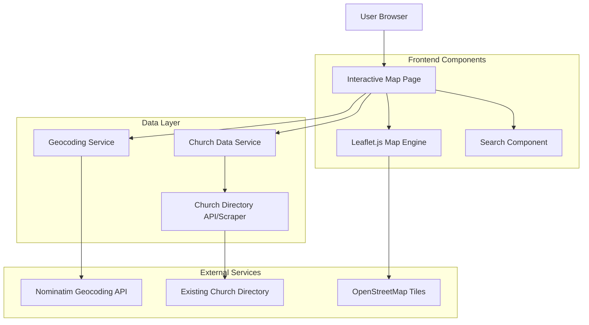

# Interactive Church Map Design Document

## Overview

The Interactive Church Map will be a standalone webpage that provides a modern, user-friendly interface for exploring New Testament Church locations across the United States. The solution will leverage Leaflet.js as the mapping library with OpenStreetMap tiles for a free, reliable mapping experience. The system will integrate with the existing church directory data and provide real-time geocoding, search functionality, and mobile-responsive design.

## Architecture

### High-Level Architecture



### Technology Stack

- **Frontend Framework**: Vanilla JavaScript with modern ES6+ features
- **Mapping Library**: Leaflet.js (lightweight, mobile-friendly, extensive plugin ecosystem)
- **Map Tiles**: OpenStreetMap (free, no API key required)
- **Geocoding**: Nominatim API (free OpenStreetMap geocoding service)
- **Styling**: CSS3 with Flexbox/Grid for responsive design
- **Data Format**: JSON for church location data
- **Build Tools**: Modern bundler (Vite or Webpack) for optimization

## Components and Interfaces

### 1. Map Container Component

**Purpose**: Main container that initializes and manages the Leaflet map instance

**Key Features**:
- Full-screen responsive map display
- Initial view centered on continental US
- Zoom controls and attribution
- Touch gesture support for mobile devices

**Interface**:
```javascript
class MapContainer {
  constructor(containerId, options)
  initializeMap()
  setView(lat, lng, zoom)
  addMarkers(churchData)
  clearMarkers()
  fitBounds(bounds)
}
```

### 2. Church Marker Component

**Purpose**: Custom marker implementation for church locations with clustering support

**Key Features**:
- Custom church icon design
- Marker clustering for dense areas
- Click event handling for info popups
- Responsive marker sizing

**Interface**:
```javascript
class ChurchMarker {
  constructor(churchData, latLng)
  createMarker()
  bindPopup(content)
  addToMap(map)
  remove()
}
```

### 3. Info Popup Component

**Purpose**: Displays detailed church information when markers are clicked

**Key Features**:
- Church name, address, and contact details
- Service times and website links
- "Get Directions" button
- Mobile-optimized layout

**Interface**:
```javascript
class InfoPopup {
  constructor(churchData)
  generateContent()
  show(latLng)
  hide()
  bindDirectionsHandler()
}
```

### 4. Search Component

**Purpose**: Location-based search functionality with autocomplete

**Key Features**:
- Text input with search suggestions
- Geocoding integration
- Search result highlighting
- Clear search functionality

**Interface**:
```javascript
class SearchComponent {
  constructor(mapInstance)
  initializeSearch()
  performSearch(query)
  clearSearch()
  highlightResults(churches)
}
```

### 5. Data Service

**Purpose**: Manages church data retrieval, caching, and geocoding

**Key Features**:
- Fetch church data from existing directory
- Geocode addresses to coordinates
- Cache geocoded results
- Error handling and retry logic

**Interface**:
```javascript
class ChurchDataService {
  async fetchChurchData()
  async geocodeAddress(address)
  getCachedData()
  setCachedData(data)
  validateChurchData(data)
}
```

## Data Models

### Church Location Model

```javascript
interface ChurchLocation {
  id: string
  name: string
  address: {
    street: string
    city: string
    state: string
    zipCode: string
    fullAddress: string
  }
  coordinates: {
    lat: number
    lng: number
    accuracy: 'high' | 'medium' | 'low'
  }
  contact: {
    phone?: string
    website?: string
    email?: string
  }
  services: {
    times?: string[]
    description?: string
  }
  lastUpdated: Date
}
```

### Search Result Model

```javascript
interface SearchResult {
  query: string
  location: {
    lat: number
    lng: number
    displayName: string
  }
  nearbyChurches: ChurchLocation[]
  radius: number
}
```

## Error Handling

### Geocoding Failures
- **Strategy**: Graceful degradation with manual coordinate fallback
- **Implementation**: Log failed geocoding attempts, display churches without coordinates in a separate list
- **User Experience**: Show notification about churches that couldn't be mapped

### Map Loading Failures
- **Strategy**: Fallback to static map or list view
- **Implementation**: Detect map initialization failures, provide alternative church directory view
- **User Experience**: Clear error message with option to retry or view list format

### Data Source Unavailability
- **Strategy**: Cached data with staleness indicators
- **Implementation**: Local storage caching with timestamp validation
- **User Experience**: Show last updated timestamp, option to refresh data

### Mobile Performance Issues
- **Strategy**: Progressive loading and marker clustering
- **Implementation**: Load markers in viewport chunks, implement efficient clustering algorithm
- **User Experience**: Loading indicators and smooth animations

## Testing Strategy

### Unit Testing
- **Components**: Test each component class in isolation
- **Data Service**: Mock API responses and test data transformation
- **Utilities**: Test geocoding, distance calculations, and data validation functions
- **Tools**: Jest with jsdom for DOM testing

### Integration Testing
- **Map Interactions**: Test marker placement, popup functionality, and search integration
- **Data Flow**: Test complete data retrieval and display pipeline
- **Responsive Behavior**: Test component interactions across different screen sizes
- **Tools**: Cypress for end-to-end testing

### Performance Testing
- **Load Testing**: Test with full dataset of church locations
- **Mobile Testing**: Test on various mobile devices and connection speeds
- **Memory Usage**: Monitor for memory leaks during extended map usage
- **Tools**: Lighthouse for performance auditing, Chrome DevTools for profiling

### Accessibility Testing
- **Keyboard Navigation**: Ensure all map functions are keyboard accessible
- **Screen Reader Support**: Test with ARIA labels and semantic markup
- **Color Contrast**: Verify marker and UI element visibility
- **Tools**: axe-core for automated accessibility testing

### Cross-Browser Testing
- **Target Browsers**: Chrome, Firefox, Safari, Edge (latest 2 versions)
- **Mobile Browsers**: iOS Safari, Chrome Mobile, Samsung Internet
- **Feature Detection**: Implement polyfills for older browser support
- **Tools**: BrowserStack for cross-browser testing automation

## Implementation Considerations

### Performance Optimization
- Implement marker clustering for areas with high church density
- Use lazy loading for church data outside current viewport
- Optimize image assets and implement caching strategies
- Minimize JavaScript bundle size through code splitting

### SEO and Accessibility
- Provide alternative text-based church directory for search engines
- Implement proper ARIA labels for map interactions
- Ensure keyboard navigation support for all functionality
- Add structured data markup for church locations

### Security Considerations
- Sanitize all user input for search functionality
- Implement rate limiting for geocoding API calls
- Use HTTPS for all external API communications
- Validate and sanitize church data before display

### Maintenance and Updates
- Design modular architecture for easy component updates
- Implement automated testing pipeline for continuous integration
- Create documentation for adding new church locations
- Plan for future feature additions (filters, advanced search, etc.)